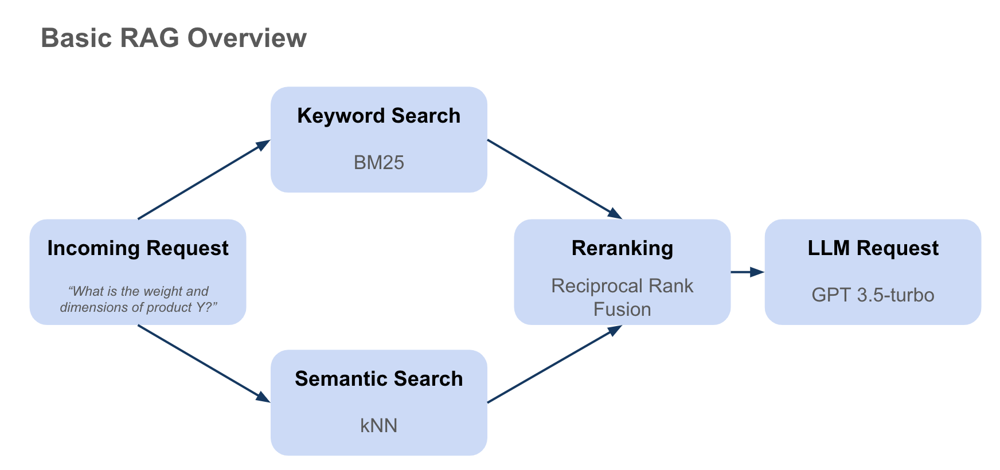

# RAG Example

This is an example for a very basic RAG architecture using **semantic search (kNN)**, **keyword search (BM25)** and **reranking with RFF**.

This is a basic example is not using any vector database, but loads all embeddings into memory. Hence this example will not work for large amounts of data. The purpose of this repo is to help RAG n00bs to familiarize with basic RAG architectures by building a RAG themselves without relying on off-the-shelf frameworks like langchain etc.

## An overview of the basic RAG overview can be found here:

## Deatils to the RAG Implementation

### Pre-Setp: Loading Data from PDF files

We load PDF files and chunk each page into multiple embeddings. Each embedding is max. 800 characters long while we try to not cut off in the middle of words/sentences. We clean the text chunks for special characters. All the chunks are embedded using OpenAI's `text-embedding-3-small`.

### 1) User Query

### 2) Semantic Search - kNN

### 3) Keyword Search - BM25

### 4) Reranking - Reciprocal Rank Fusion (RFF)

### 5) Output Generation - LLM Request

Working with RAG you will soon realise it still is an immature technoloy. We might add more compley steps to this RAG for presentation purposes.
